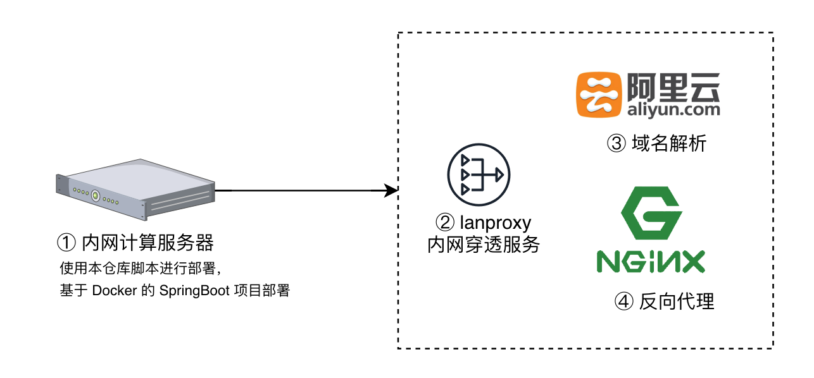
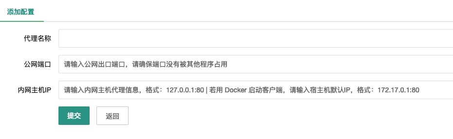
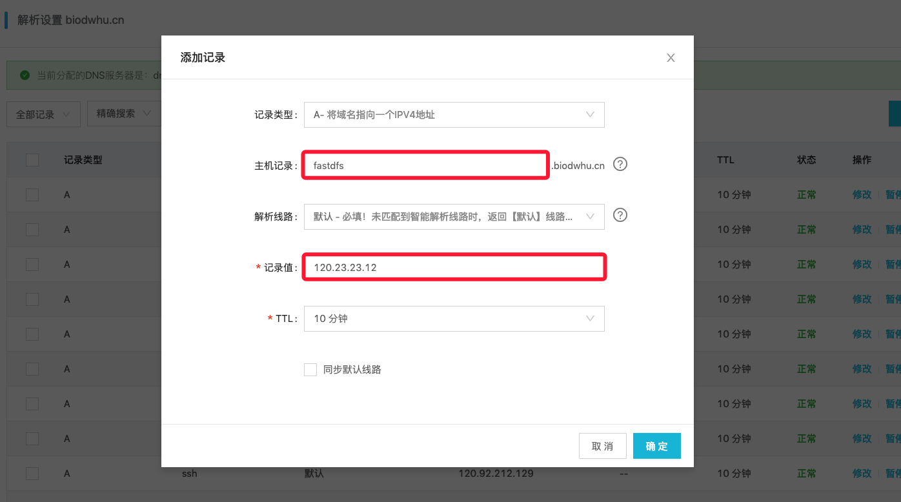

# 基于 mvn + docker 的 springboot 项目部署实战

## 前置环境

- docker
- docker-compose
- Jdk 1.8
- maven


## 快速启动



### 文件目录结构

```
├── build-image.sh          构建镜像脚本
├── Dockerfile              镜像文件
├── docker-compose.yml      Docker-compose 启动文件
├── run.sh

├── docker-springboot-demo  Java/SpringBoot 项目代码部分
        ├── src
        └── porm.xml
├── run-logs                项目运行日志文件
├── target                  项目代码生成文件
        ├── src
        └── startup.sh      容器内项目启动文件
```


### 开始前准备

1. 进入你的项目代码目录，例如本仓库中的：`docker-springboot-demo`，为你的 SpringBoot 项目代码目录。在该目录下只需要存放：`porm.xml ` 和 `src/` 两部分，并使用 `mvn clean package` 测试是否能够成功生成 `target/` 目录，并生成 jar 包
2. 请确保你的项目代码补录中可以通过 `git pull` 方式进行代码更新，方便实现一键脚本运行


### 需要配置哪些文件？

将你的代码文件拉到本仓库中，例如本目录中的 `docker-springboot-demo` 目录，当然可以改成你自己的名字，但相应的配置文件中出现的目录名需要修改

1. 配置 docker-compose.yml

```yml
version: '3.1'
serviies:
  # 修改为你的项目名字
  springboot-hello-server:
    restart: always
    build: '.'
    # 修改容器名字，请勿重名，否则无法启动
    container_name: springboot-hello
    # 配置端口号，只需要修改冒号左边的端口即可，右边 8080 是容器中的端口号，请根据实际情况来修改
    ports:
      - 9195:8080
    # 配置数据卷映射目录，修改左边你的日制文件需要保存的位置
    volumes:
      - /run-logs:/webapp/run-logs
```

2. 修改 run.sh 中的配置项

```shell
project_name=‘你的项目名字，和你的代码目录一致’
```

- 注意：请确保 git 的身份验证，否则再 git pull 的步骤会无法更新代码

3. 修改 target/startup.sh 容器内启动文件

```shell
jar_name='你的项目 Jar 包生成文件名'
```

- 注意：可以根据具体运行情况修改

### 项目启动

```shell
sh run.sh
```

项目启动后即刻使用你的 `IP:Port` 进行访问


## 域名配置

1. 配置内网穿透服务（lanproxy）



2. 阿里云后台域名解析一个 A 类地址，例如：fastdfs   - > 120.23.23.12



3. 配置 Nginx 反向代理服务，`/etc/nginx/conf.d` 目录下创建你的配置文件，例如以下格式：`fastdfs.biodwhu.cn.conf`

```
server {
    listen 80;
    server_name fastdfs.biodwhu.cn;
    location / {
        proxy_pass http://127.0.0.1:9060/;
        proxy_set_header X-Real-IP $remote_addr;
        proxy_set_header X-Forwarded-For $proxy_add_x_forwarded_for;
        proxy_set_header Host $http_host;
        proxy_set_header N-NginS-Proxy true;
    }
 }
```

重启 Nginx 服务，`service nginx restart`

4. 此时即刻访问 `fastdfs.biodwhu.cn` 服务！


## 项目配置附录

### run.sh

```shell
# 配置
## 代码项目名称
project_name='docker-springboot-demo'

# 更新代码
cd $project_name/ ; git pull ;cd ..

# 打包程序
rm target/*.jar -f
cd $project_name/
mvn clean package
cp target/*.jar ../target/ -f
cd ..

# 启动项目
docker-compose up -d --build --force-recreate

# 构建镜像
# sh build-image.sh
# docker-compose up -d
```


### restart.sh

```shell
docker-compose down
sh run.sh
```


### stop.sh

```shell
docker-compose down
```


### Dockerfile

```shell
FROM openjdk:8

WORKDIR /
COPY target ./webapp

WORKDIR /webapp

ENTRYPOINT ["/webapp/startup.sh"]

CMD ["/bin/bash"]
```


### target/startup.sh

```shell
#!/bin/bash

# java -jar /mail-server/mail-consumer.jar --name="Spring" --server.port=8090 &
# nohup java -jar mail-producer.jar --name="Spring" --server.port=8080 > mail-producer.log &

# 请修改你的 Jar 包名
jar_name='quick-docker-1.0-SNAPSHOT.jar'

tname=`date +%Y-%m-%d-%H%M%S`

touch index.html
echo "startup the webapp" > index.html

nohup java -jar ${jar_name} --name="Spring" --server.port=8080 > "run-logs/webapp-${tname}.log" 2>&1 &

tail -f index.html
```

